# Team Vikings

SmartAR is an AR app developed in unity by the team <b>Vikings</b>, for the HackAgainstCovid Hackathon.

Demo Video can be found [here](https://youtu.be/LBWM4lwSTpo)

](https://youtu.be/LBWM4lwSTpo)
# Features
While theoretical knowledge can be disseminated through online videos and e-schooling, students, particularly those pursuing STEM, miss out on the practical side of their education. A number of STEM courses in High school and university rely on access to laboratories to conduct practical sessions and experiments. Unfortunately, due to the spread of COVID-19 most students are unable to access laboratories and hence miss out on the practical component of their education.

SmartAR looks at a new way of doing labs. The app has inbuilt AR experiments to help students perform experiments from the comfort and safety of their homes. A person will be given three options Practice Mode, Test Mode and Flash Cards.
- ### Practice Mode:  
    In this mode this mode the person can select an experiment which he can practice and test different combinations in the experiment.
- ### Test Mode:
    In this mode a student can type in the test code and give a lab test which will be immidiately graded and the marks will be stored on the blockchain.
- ### Flash Cards:
    These are to help students memorize hard concepts and make it possible for them to use one of the most common techniques to memorize premade flashcard. Topic based models and question are directly fetched from Echo AR so we can keep adding more without any change to the code.

## Technology Used
- <b>Photoshop
- Unity
- Blender
- Vuforia 
- EchoAR
- Matic
- Ethereum
- Remix
- Infura
- Soliity
- ARFoundation
- IBM Watson</b>

## Requirements

Before building the project, please ensure that the project has the following plugins and dependencies installed:

- <b>Firebase
- IBM(Core and Watson)
- Matic
- RestClient
</b>

## Screenshots

<b>

- EchoAR Dasboard 
  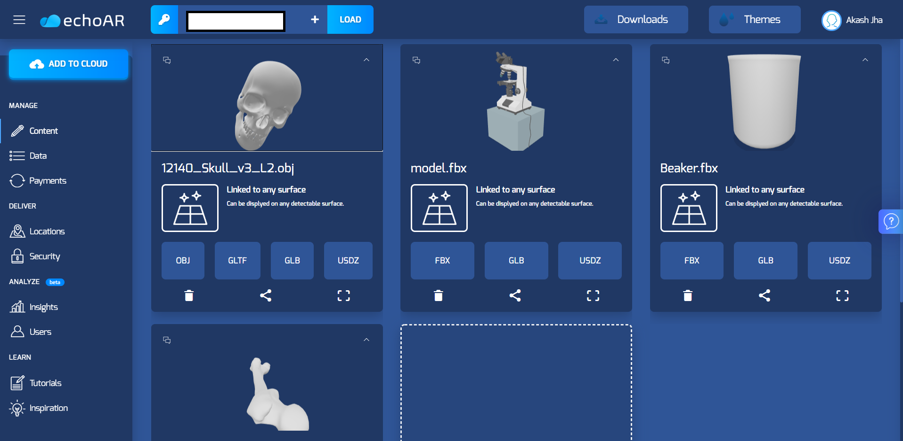
  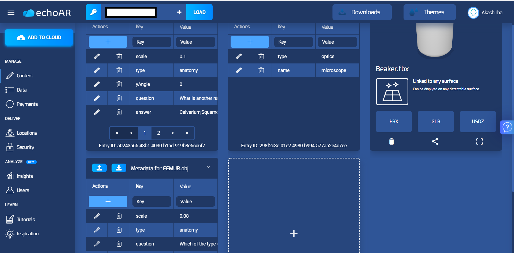 
- Matic testnet v3 Dashboard 
    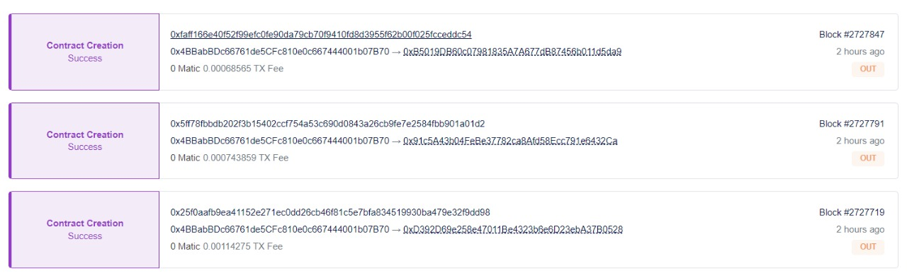 
- Metamask Dashboard 
    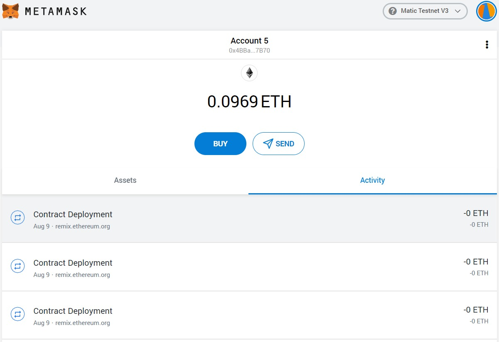 
- Unity Collaborate Commit History(As of 3PM 9th August)

  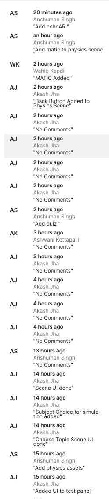
  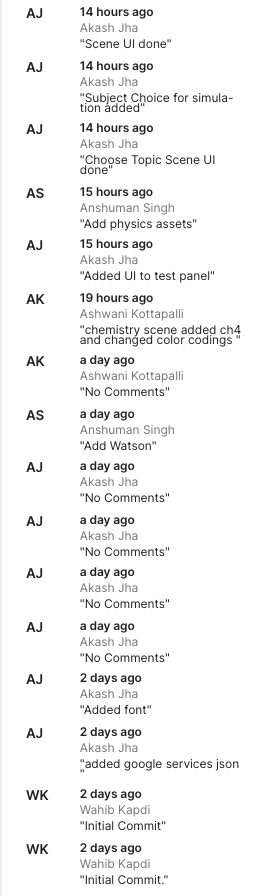
- App Screenshots 
    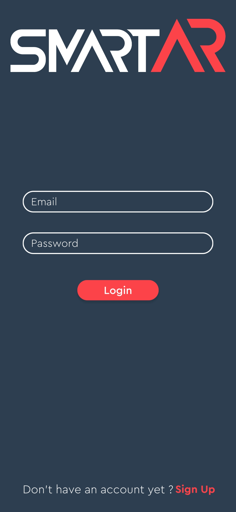
    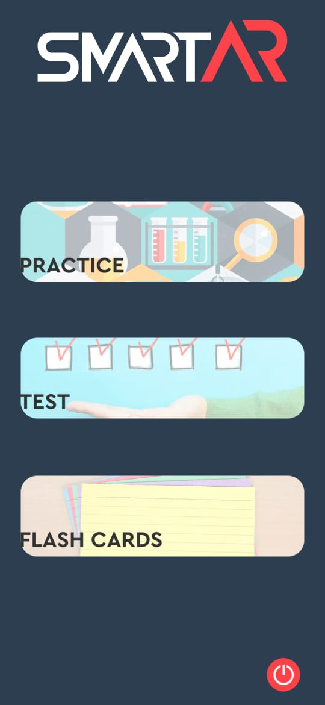
    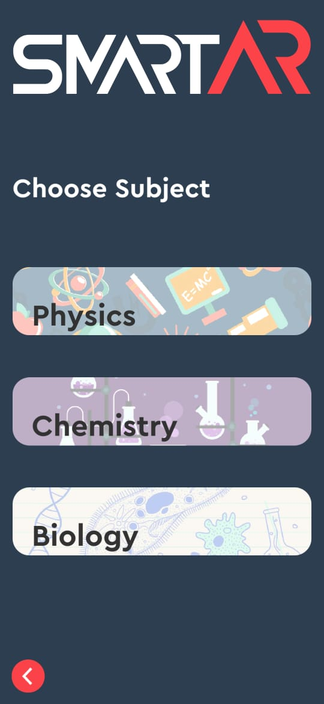
    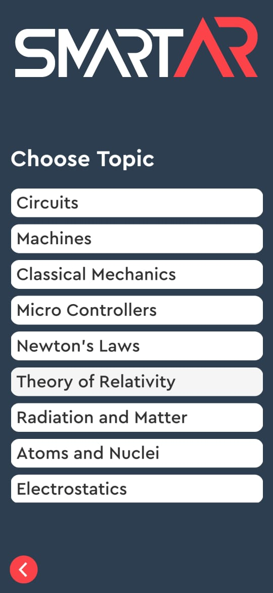
    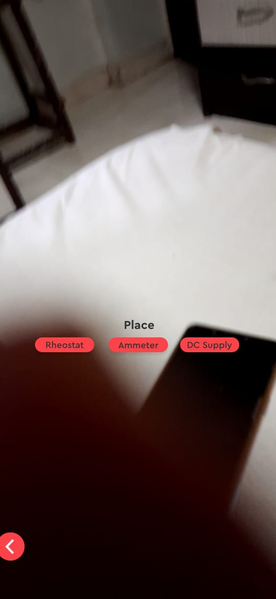
    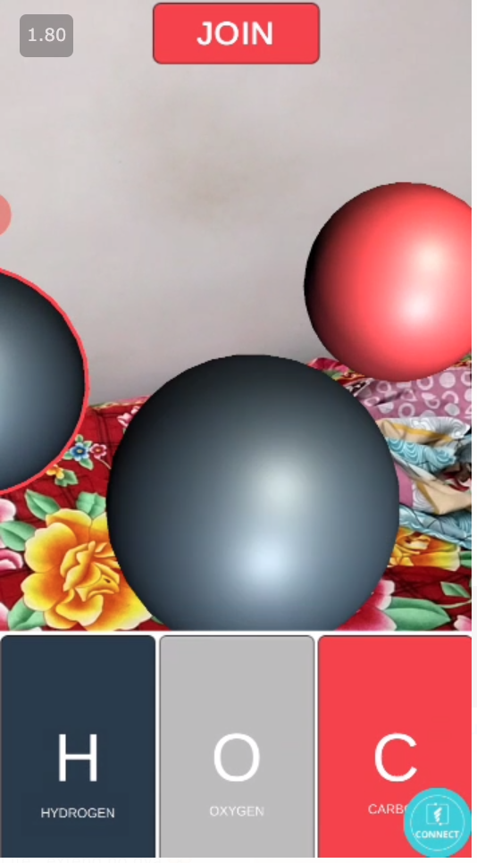
    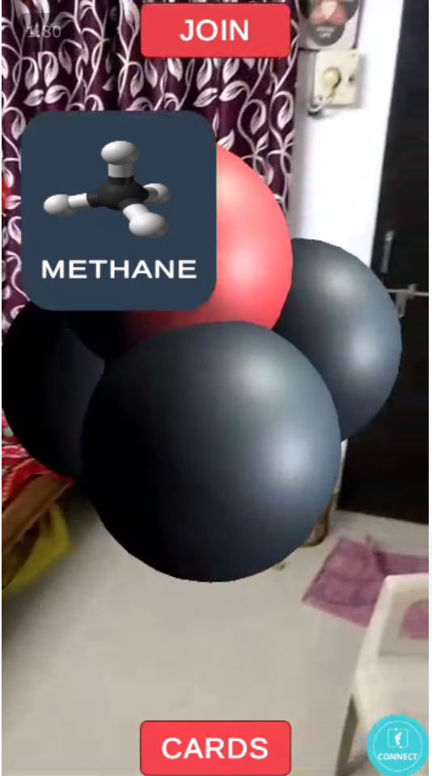

</b>

